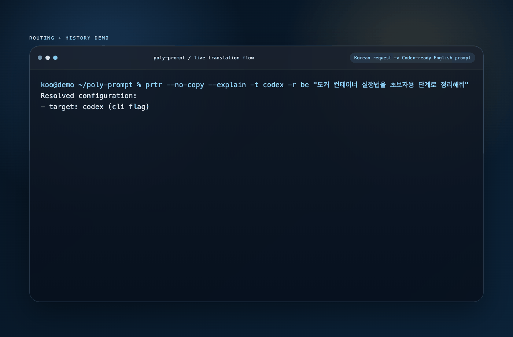
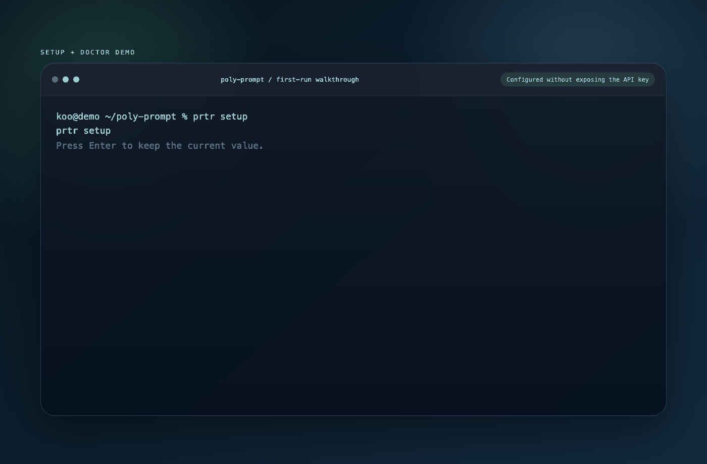
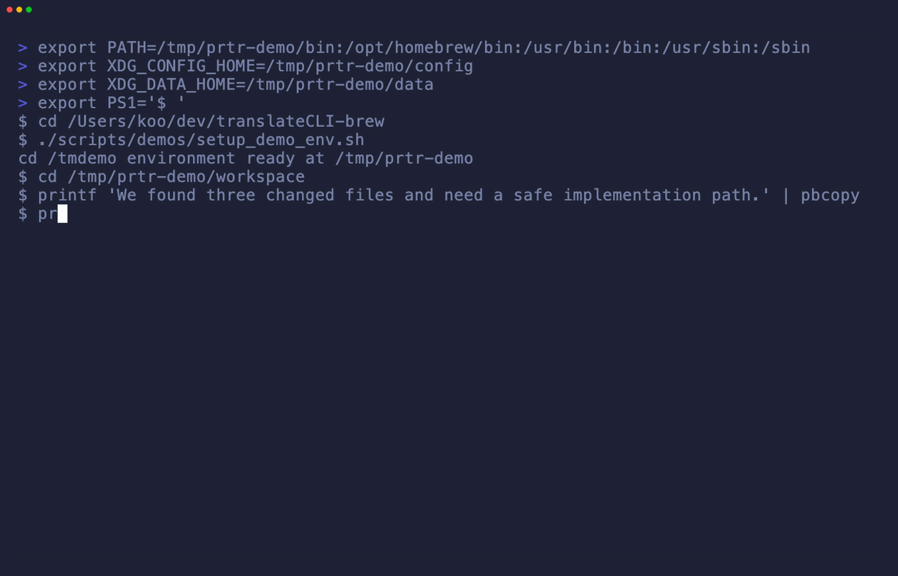

# poly-prompt

[](https://helloprtr.github.io/poly-prompt/)
[](https://helloprtr.github.io/poly-prompt/docs/)
[](https://github.com/helloprtr/poly-prompt/releases/tag/v0.6.3)

[English README](README.md) · [한국어 README](README.ko.md) · [Docs Hub](https://helloprtr.github.io/poly-prompt/docs/) · [Releases](https://github.com/helloprtr/poly-prompt/releases)


**One line:** `prtr` is the command layer for AI work: turn intent, logs, and diffs into the next AI action across Claude, Codex, and Gemini.

`prtr` helps you send the first prompt faster and keep the loop moving after that. Instead of rebuilding the same context by hand, you can route once, compare another AI app, and turn the answer into the next structured action.

## See It Work



One request in Korean. Another AI app. A structured next action. No prompt glue.

## Try It in 60 Seconds

macOS with Homebrew:

```bash
brew tap helloprtr/homebrew-tap
brew install prtr
prtr demo
prtr go "explain this error" --dry-run
```

Linux and Windows:

Download the right archive from [GitHub Releases](https://github.com/helloprtr/poly-prompt/releases), put `prtr` on your `PATH`, then run the same two commands above.

When you want the real loop:

```bash
npm test 2>&1 | prtr go fix "왜 깨지는지 정확한 원인만 찾아줘"
prtr swap gemini
prtr take patch --deep
prtr learn
```

No API key is required for `prtr demo` or English `--dry-run` flows. Use `prtr start` when you want a guided first send.

## Core Loop

| Command | What it does |
|---|---|
| `go` | Turn intent plus evidence into a ready prompt for Claude, Codex, or Gemini |
| `swap` | Resend the last run to another AI app without rebuilding context |
| `take` | Convert copied AI output into the next structured action |
| `take --deep` | Run the internal multi-step pipeline before delivery |
| `again` | Replay the last run with optional edits |
| `learn` | Build repo memory and protected terms that survive translation |
| `inspect` | Preview the assembled routing path before delivery |

## More Visual Proof

| Setup and doctor | Delivery and paste |
|---|---|
|  |  |

## Documentation

- Start here: [Docs Hub](https://helloprtr.github.io/poly-prompt/docs/)
- Install and update: [INSTALLATION.md](INSTALLATION.md)
- Day-to-day usage: [docs/guide.md](docs/guide.md)
- Command reference: [docs/reference.md](docs/reference.md)
- Korean guide: [docs/guide.ko.md](docs/guide.ko.md)
- Project site: [helloprtr.github.io/poly-prompt](https://helloprtr.github.io/poly-prompt/)

## Contributing

- Contribution guide: [CONTRIBUTING.md](CONTRIBUTING.md)
- Starter tasks: [good first issue](https://github.com/helloprtr/poly-prompt/issues?q=is%3Aopen+is%3Aissue+label%3A%22good+first+issue%22)
- Broader help: [help wanted](https://github.com/helloprtr/poly-prompt/issues?q=is%3Aopen+is%3Aissue+label%3A%22help+wanted%22)
- Early ideas and workflow feedback: [Discussions](https://github.com/helloprtr/poly-prompt/discussions)

If you maintain this repo, keep 3 to 5 small, current `good first issue` tickets live. The best starter issues explain the user pain clearly, define done criteria, and include one local verification command.
